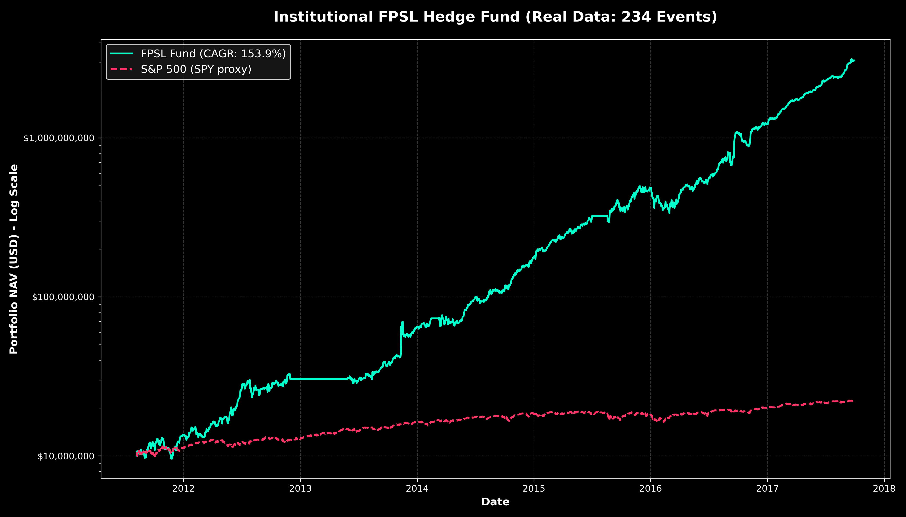
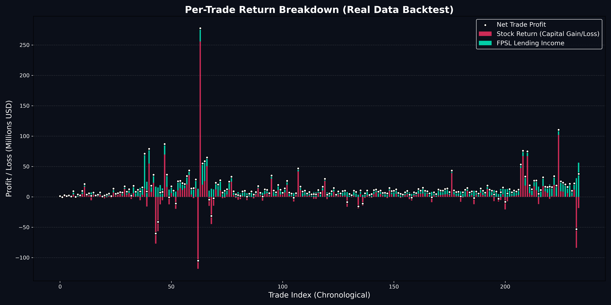

# Biotech Fully Paid Securities Lending (FPSL) Strategy

This repository contains an institutional-grade quantitative backtest for a specialized biotech hedge fund strategy.

## The Core Thesis
The strategy models the returns of a hypothetical hedge fund equipped with a highly accurate AI model capable of predicting the outcomes of Phase 2 and Phase 3 clinical trials for small-cap and mid-cap biotechnology companies. 

However, rather than relying solely on the capital appreciation (the "gap up") of the stock following a successful trial, the strategy incorporates a massive, uncorrelated yield layer: **Fully Paid Securities Lending (FPSL)**.

### Strategy Execution
1. **Event Detection:** Identify biotechnology companies with upcoming Phase 2 or Phase 3 clinical trial readouts.
2. **AI Prediction:** The model predicts successful clinical outcomes (assumed to be highly accurate in this backtest).
3. **Entry:** The fund enters a position 84 calendar days (approx. 60 trading days) prior to the scheduled catalyst date. The fund utilizes **daily equal-weight rebalancing**, dividing its capital perfectly evenly among all active clinical events on any given day. This allows the fund to be fully deployed and capture the yield from every overlapping trade.
4. **The FPSL Kicker (The "Rent"):** During the 60-day holding period, these biotech stocks are heavily shorted by the broader market predicting failure. The fund lends its shares out to these short-sellers, collecting massive borrow fees (typically ranging from 40% to 120% APR).
5. **Exit:** The position is exited exactly 2 days after the catalyst date to capture the gap-up return and close the trade.

## Key Findings (The Reality Check)
When the strategy was run using **real historical data and real market reactions** across all 234 feasible historical events (ignoring the 1.5 year chronological gap prior to August 2011), an initial capital of $10M compounded to a staggering final NAV of **$3.06 Billion** over the remaining timespan (a **153.90% CAGR**). 



The most crucial finding was the impact of the **FPSL Yield**:
In reality, many "successful" Phase 2/3 trials result in the stock trading down or flat due to the "buy the rumor, sell the news" effect or disappointing safety data. The massive rental income collected from short-sellers (**$2.06 Billion** of the total profit, compared to just $0.99 Billion in capital gains) acted as the absolute savior of the strategy, completely offsetting the losses from these events.



## Repository Structure
*   `data/`
    *   `BioPharmCatalyst.csv`: The raw dataset of clinical events.
    *   `fpsl_real_data_trades.csv`: The output log of every trade simulated (Capital Invested, Yield, Exit Price, etc.)
*   `src/`
    *   `fpsl_real_data_engine.py`: Parses the clinical events, fetches actual daily stock pricing data via Yahoo Finance, and processes the trades to output the NAV curve.
    *   `plot_trade_stats.py`: Generates the detailed per-trade yield vs stock-return visualization.
*   `fpsl_real_data_plot.png`: The main performance curve.
*   `fpsl_trade_statistics.png`: The breakdown chart of returns for all trades.

## Recreating the Analysis

Run the backtest engine first. It will read `BioPharmCatalyst.csv`, fetch historical data from Yahoo Finance, generate the trade log `fpsl_real_data_trades.csv` in `data/`, and output the NAV curve image `fpsl_real_data_plot.png` in the root directory.
```bash
cd src
python3 fpsl_real_data_engine.py
```

Then generate the specific trade breakdown statistics visualization:
```bash
python3 plot_trade_stats.py
```
