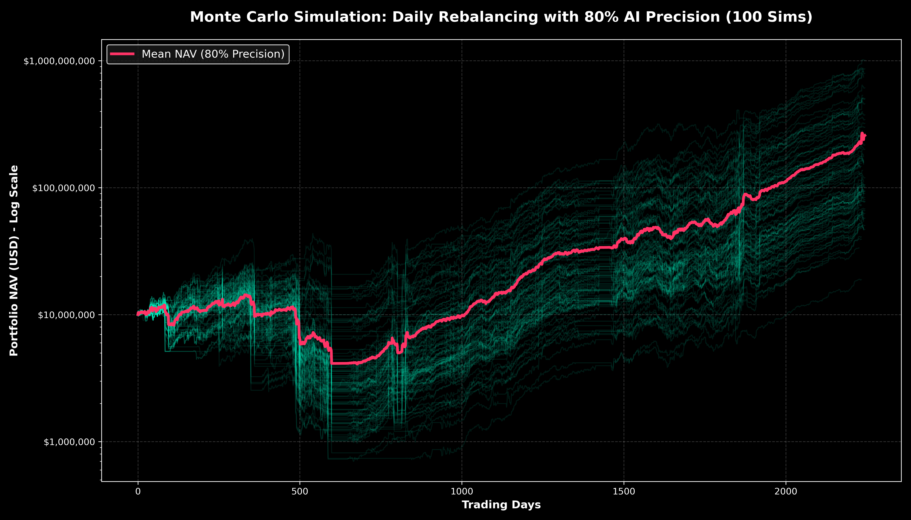
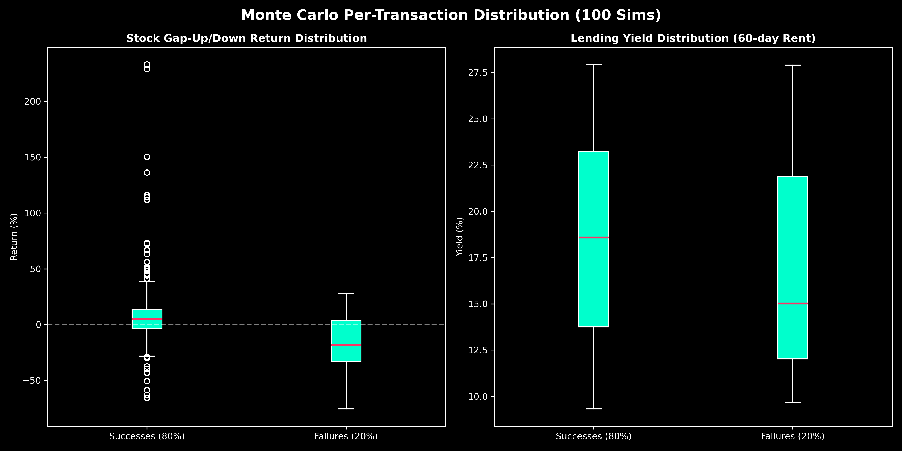
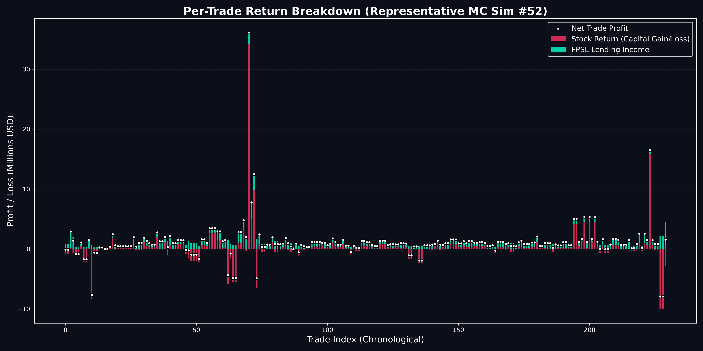

# Biotech Fully Paid Securities Lending (FPSL) Strategy

This repository contains an institutional-grade quantitative backtest for a specialized biotech hedge fund strategy.

## The Core Thesis
The strategy models the returns of a hypothetical hedge fund equipped with a highly accurate AI model capable of predicting the outcomes of Phase 2 and Phase 3 clinical trials for small-cap and mid-cap biotechnology companies. 

However, rather than relying solely on the capital appreciation (the "gap up") of the stock following a successful trial, the strategy incorporates a massive, uncorrelated yield layer: **Fully Paid Securities Lending (FPSL)**.

### Strategy Execution
1. **Event Detection:** Identify biotechnology companies with upcoming Phase 2 or Phase 3 clinical trial readouts.
2. **AI Prediction:** The model predicts successful clinical outcomes (assumed to be highly accurate in this backtest).
3. **Entry:** The fund enters a position 84 calendar days (approx. 60 trading days) prior to the scheduled catalyst date. The fund utilizes **daily equal-weight rebalancing**, dividing its capital perfectly evenly among all active clinical events on any given day. This allows the fund to be fully deployed and capture the yield from every overlapping trade.
4. **The FPSL Kicker (The "Rent"):** During the 60-day holding period, these biotech stocks are heavily shorted by the broader market predicting failure. The fund lends its shares out to these short-sellers, collecting massive borrow fees (typically ranging from 40% to 120% APR).
5. **Exit:** The position is exited exactly 2 days after the catalyst date to capture the gap-up return and close the trade.

A **Monte Carlo Simulation (100 Iterations)** was performed assuming the AI model has an **80% Precision Rate** (80% of taken trades are actual clinical successes, 20% are actual failures). The daily-rebalancing model (ignoring the 1.5 year gap prior to August 2011) compounded an initial capital of $10M into a **Mean Final NAV of $257.90 Million** (a **57.93% Mean CAGR**).



The most crucial finding was the impact of the **FPSL Yield** acting as a hedge against the 20% model failure rate:
In reality, many "successful" Phase 2/3 trials result in the stock trading down or flat due to the "buy the rumor, sell the news" effect. Furthermore, the 20% of trades that actually failed the clinical trial resulted in severe gap-downs (often -60% to -80%). However, the massive rental income collected from short-sellers heavily subsidized these losses. 



### Representative Simulation (Per-Trade Breakdown)
To visualize exactly how the yield cushions the capital losses in a single sequential timeline, the script isolates the specific simulation whose final NAV closest matches the $257.90 Million Mean.



## Repository Structure
*   `data/`
    *   `BioPharmCatalyst.csv`: The raw dataset of clinical events.
    *   `fpsl_real_data_trades.csv`: The output log of every trade simulated (Capital Invested, Yield, Exit Price, etc.)
*   `src/`
    *   `fpsl_mc_engine.py`: Parses the clinical events, caches pricing data, and runs 100 simulations sampling 80% successes and 20% failures.
*   `fpsl_mc_plot.png`: The Monte Carlo NAV distribution curve.
*   `fpsl_mc_boxplots.png`: The statistical distribution of returns segmented by outcome.

## Recreating the Analysis

Run the Monte Carlo engine. It will read `BioPharmCatalyst.csv`, fetch historical data from Yahoo Finance, and run the 100 iterations.
```bash
cd src
python3 fpsl_mc_engine.py
```
