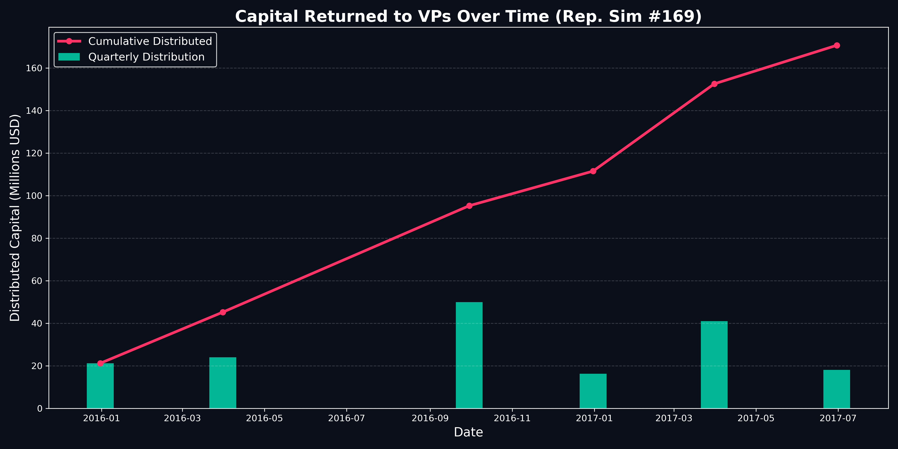

# Biotech Fully Paid Securities Lending (FPSL) Strategy

This repository contains an institutional-grade quantitative backtest for a specialized biotech hedge fund strategy.

## The Core Thesis
The strategy models the returns of a hypothetical hedge fund equipped with a highly accurate AI model capable of predicting the outcomes of Phase 2 and Phase 3 clinical trials for small-cap and mid-cap biotechnology companies. 

However, rather than relying solely on the capital appreciation (the "gap up") of the stock following a successful trial, the strategy incorporates a massive, uncorrelated yield layer: **Fully Paid Securities Lending (FPSL)**.

### Strategy Execution
1. **Event Detection:** Identify biotechnology companies with upcoming Phase 2 or Phase 3 clinical trial readouts.
2. **AI Prediction:** The model predicts successful clinical outcomes (assumed to be highly accurate in this backtest).
3. **Entry:** The fund enters a position 84 calendar days (approx. 60 trading days) prior to the scheduled catalyst date. The fund utilizes **daily equal-weight rebalancing**, dividing its capital perfectly evenly among all active clinical events on any given day. This allows the fund to be fully deployed and capture the yield from every overlapping trade.
4. **The FPSL Kicker (The "Rent"):** During the 60-day holding period, these biotech stocks are heavily shorted by the broader market predicting failure. The fund lends its shares out to these short-sellers, collecting massive borrow fees (typically ranging from 40% to 120% APR).
5. **Exit:** The position is exited exactly 2 days after the catalyst date to capture the gap-up return and close the trade.

A **Realistic Monte Carlo Simulation (1000 Iterations)** was performed focusing exclusively on **Small Molecule** drugs, assuming the AI model has an **80% Precision Rate**. To model real-world institutional scaling limits, we implemented a strict **$100M AUM Hard Cap**. At the end of every calendar quarter, any capital exceeding $100M is swept from the fund and recorded as a cash distribution returned to the VPs/LPs.

Under these highly constrained parameters, compounding an initial capital of $10M resulted in the fund continuously hitting its $100M ceiling and paying out massive distributions, demonstrating extreme cash-generation capability.


The most crucial finding was the impact of the **FPSL Yield** acting as a hedge against the 20% model failure rate:
In reality, many "successful" Phase 2/3 trials result in the stock trading down or flat due to the "buy the rumor, sell the news" effect. Furthermore, the 20% of trades that actually failed the clinical trial resulted in severe gap-downs (often -60% to -80%). However, the massive rental income collected from short-sellers heavily subsidized these losses. 


### Capital Returned to VPs Over Time
To visualize the extreme cash-generation of the strategy once it hits the $100M capacity ceiling, we plotted the quarterly distributions for a representative simulation run:



### Representative Simulation (Per-Trade Breakdown)
To visualize exactly how the yield cushions the capital losses in a single sequential timeline, the script isolates a specific representative simulation run.


## Real-World Viability Critique: Can This Be Executed?

If a fund manager actually possessed an AI model with a proven, sustained **80% Precision Rate** predicting clinical trial outcomes, this strategy would be massively profitable. However, the initial theoretical $701M Final NAV (175% CAGR) was an abstraction. In the real world, several major institutional roadblocks prevent compounding at this exact exponential scale. As our updated "100M Hard-Cap" simulation shows, the fund essentially becomes a massive cash-printing machine that must regularly distribute its excess profits back to its VPs to stay under its liquidity ceiling.

Here is a breakdown of the real-world friction this strategy would face:

### 1. Capacity Constraints and Liquidity (The Scaling Problem)
The most fatal flaw in the exponential compounding curve is **liquidity**. The strategy targets small-to-mid-cap biotechnology companies. As the fund's NAV grows from $10M to $100M, and eventually $700M, the position sizes become too large for the underlying stocks.
*   **Slippage:** Trying to deploy $5M to $15M into a micro-cap biotech stock over a few days will cause massive slippage. The fund's buying pressure will drive the entry price up, and its selling pressure post-catalyst will drive the exit price down, destroying the modeled returns.
*   **Float Ownership:** At $700M NAV, equal-weighting across 5 active events means buying $140M of a single small-cap biotech. In many cases, this is more than the entire market capitalization of the company. You cannot execute this strategy past a certain NAV capacity without becoming an activist investor or triggering SEC threshold filings. This is why the fund must be hard-capped at **$100M** and return excess capital to VPs.

### 2. The Mechanics of Securities Lending
The simulation assumes the fund can perfectly lend 100% of its shares at extreme Hard-to-Borrow (HTB) rates (100%-300% APR).
*   **Borrow Demand Caps:** Just because a stock is HTB does not mean there is infinite demand from short-sellers to borrow your shares. If you buy $20M of a stock, there may only be $2M of actual short demand willing to pay those extreme rates.
*   **Prime Broker Cuts:** The simulation assumes the fund keeps 100% of the yield. In reality, prime brokers take a massive cut (often 20% to 50%) of the lending revenue generated from your Fully Paid Securities Lending (FPSL) program.

### 3. Gap-Down Liquidity on the 20% Failures
The simulation models failures as a randomized -40% to -85% loss. However, when a binary clinical trial fails, the stock is often halted. When it unhalts, there are zero buyers. The price gaps down violently. Attempting to liquidate a massive position in a failed biotech could result in far worse execution than the modeled -85%. You could easily be trapped in the position or forced to liquidate at -95%.

### 4. Overlapping Event Windows
The model assumes you can precisely equal-weight capital across overlapping events. In reality, catalyst dates are famously unpredictable (e.g., "Q3 2016" or "1H 2017"). It is impossible to perfectly timeline the entry and exit dates of these trades in advance, which forces the fund to hold un-invested cash, creating cash drag and lowering the CAGR.

### Conclusion
**The Verdict:** Yes, this strategy is highly viable and extremely lucrative, **but only up to a $100M AUM ceiling**. 
With an 80% accurate AI model, a smaller fund could effortlessly execute these trades, extract the massive short-seller rent, and compound rapidly up to $100M. Once it hits that liquidity constraint, the inability to buy more float forces the fund to stop compounding and start paying out massive quarterly distributions to cap the AUM.

## Repository Structure
*   `data/`
    *   `BioPharmCatalyst.csv`: The raw dataset of clinical events.
    *   `fpsl_real_data_trades.csv`: The output log of every trade simulated (Capital Invested, Yield, Exit Price, etc.)
*   `src/`
    *   `fpsl_mc_engine.py`: Parses the clinical events, caches pricing data, and runs 100 simulations sampling 80% successes and 20% failures.
*   `fpsl_mc_plot.png`: The Monte Carlo NAV distribution curve.
*   `fpsl_mc_boxplots.png`: The statistical distribution of returns segmented by outcome.

## Recreating the Analysis

Run the Monte Carlo engine. It will read `BioPharmCatalyst.csv`, fetch historical data from Yahoo Finance, and run the 100 iterations.
```bash
cd src
python3 fpsl_mc_engine.py
```
